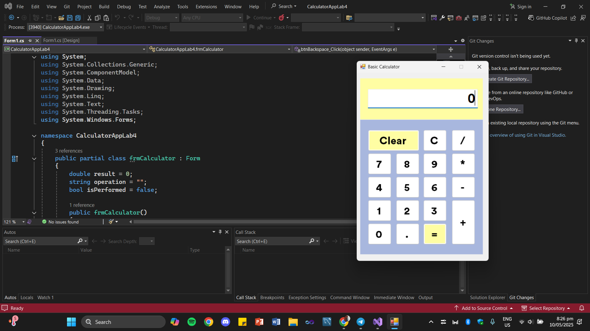

##  🖩 Simple Calculator App
A simple Windows Forms Calculator application built using C# and .NET Framework. This project demonstrates basic Windows Forms usage and event-driven programming.

## ➕ Features
- Standard calculator functionality (basic arithmetic) <br>
- Simple, intuitive graphical user interface (GUI) <br>
- Built using WinForms and C# <br>

<br>

## ➖ Technologies Used
- C# <br> 
- .NET Framework <br>
- Windows Forms (WinForms) <br>

<br>

##  ➗ Project Structure
```
CalculatorAppLab4/
│
├── Program.cs             # Main application entry point
├── frmCalculator.cs       # Calculator form logic
├── frmCalculator.Designer.cs  # Form designer-generated code
└── frmCalculator.resx     # Form resources
```

 ## ✖️ Instructions on Running the App <br>
1. Clone the repository:

   ```bash
   git clone https://github.com/your-username/CalculatorAppLab4.git
   ```
2. Open the solution file (`CalculatorAppLab4.sln`) in Visual Studio.
3. Build the project:

   ```bash
   Ctrl+Shift+B  # or Build > Build Solution
   ```
4. Run the application:

   ```bash
   F5  # or Debug > Start Debugging
   ```
## 📸 Screenshot



## 🟰 Team Members

| Name           | Role           | 
| -------------- | -------------- |
| John Richnell Catibog    | 23-04985@g.batstate-u.edu.ph|
| Jerzha Ara Ramil Lalu    | 23-05464@g.batstate-u.edu.ph |
| Ken Ian Ramirez  | 23-00686@g.batstate-u.edu.ph | 
| Albert Soriano Jr.    | 23-03014@g.batstate-u.edu.ph |


